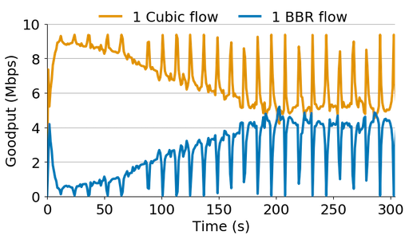

+++
# The title of your blogpost. No sub-titles are allowed, nor are line-breaks.
title = "Modeling BBRv1's Interactions with Loss-Bassed Congestion Control"
# Date must be written in YYYY-MM-DD format. This should be updated right before the final PR is made.
date = 2024-08-26

[taxonomies]
# Keep any areas that apply, removing ones that don't. Do not add new areas!
areas = ["Systems"]
# Tags can be set to a collection of a few keywords specific to your blogpost.
# Consider these similar to keywords specified for a research paper.
tags = ["computer-networks", "congestion-control"]

[extra]
author = {name = "Ranysha Ware", url = "https://www.cs.cmu.edu/~rware/" }
# The committee specification is  a list of objects similar to the author.
committee = [
    {name = "Mor Harchol-Balter", url = "https://www.cs.cmu.edu/~harchol/"},
    {name = "Peter Steenkiste", url = "https://www.cs.cmu.edu/~prs/"},
    {name = "Christopher Canel", url = "https://www.ccanel.com/"}
]
+++

<!-- After filling in the above "top-matter", as per instructions provided
in the `.md` file, you can write the main body of the blogpost here
onwards. Commonly used examples of syntax are shown below.

You can run `./local_server.sh` at the root of the repository to see
how the final blogpost looks in action. -->

In 2006, Senator Ted Stevens infamously described the Internet as a "series of tubes'', where "filled tubes'' delayed his email. While Senator Stevens was ridiculed at the time for his simplistic understanding of the Internet, his characterization was not entirely wrong:

>"It's a series of tubes. And if you don't understand, those tubes can be filled and if they are filled, when you put your message in it, it gets in line and it's going to be delayed by anyone that puts into that tube enormous amounts of material..."

The more technical term for what Senator Stevens describes here is congestion. Logical "tubes" are created between two end-points across a network by transport protocols like TCP. These tubes run over physical links with limited capacity which may become filled by competing traffic. If end-points send more data into the network than the capacity of these links, the network becomes overloaded and congested, delaying packets and degrading throughput. If congestion goes unchecked, the network can become so slow it grinds to a halt, a condition called congestion collapse.

Historically, all senders could share an overloaded network if all senders used the same congestion control algorithm (CCA). For example, if all senders used a loss-based CCA like TCP Reno, then all senders could share the network both fairly and efficiently, *without explicit coordination between the senders.* However, over the past 30 years since TCP Reno's deployment, large content providers have proposed and deployed novel CCAs to keep up with growing demands of a faster Internet, emerging applications like video conferencing, and billions of mobile users. Since the senders must implement congestion control, content providers can deploy any CCA. Consequently, if we are moving away from a homogenous deployment of one loss-based CCA to a wild-west of many CCAs, the fairness of the Internet is at stake.

Most notable of these new algorithms is TCP BBR, proposed and deployed by Google in 2016, including an open-source implementation in the Linux kernel. When Google published BBR, it resulted in a surge of researchers studying the algorithm; could BBR fairly share with the already widely deployed loss-based CCA TCP Cubic? Several studies showed empirically with experiments in controlled testbeds that BBR could be very unfair to Cubic with little explanation for why. Consequently, in this work, we ask if we can determine when and why BBR is unfair to Cubic.

In the past, researchers have used modelling to understand a CCA’s behavior. For example, the [Mathis equation](https://www.cs.utexas.edu/~lam/395t/papers/Mathis1998.pdf) showed TCP Reno’s throughput is inversely proportional to the loss rate. So in this work, we build a similar model to understand a BBR flow’s throughput when competing with other flows.

Our model has an important finding: BBR’s throughput when competing with loss-based algorithms does not depend on the number of competing loss-based flows. Regardless of the number of competing flows, BBR flows will always achieve a fixed fraction of the available throughput.

# How does BBRv1 work?

BBR is designed to be a rate-based algorithm. In contrast to window-based TCP variants (for example Cubic and Reno) which control the amount of in-flight data, BBR’s goal is to figure out what its fair share of the bottleneck link is and to pace the sending of packets at exactly that rate.

A BBR flow determines its sending rate by repeatedly probing for bandwidth (in its ProbeBW state) over 8 round trip times (RTTs). For 6 RTTs, BBR will send at rate \\(R\\), its current maximum achieved throughput. Then BBR will send at a higher rate to see if it can get better throughput. It does this by increasing its sending rate to \\(1.25R\\) for 1 RTT and observing the achieved throughput. Finally, it will reduce its sending rate to \\(0.75R\\) for 1 RTT to drain any excess packets from the queue. If a BBR flow observes a higher achieved throughput, it will adjust its sending rate \\(R\\) to what it now thinks is its maximum throughput. In total, these steps (ProbeBW) take 8 RTTs. BBR will repeat this 8 RTT cycle over and over again.

When one BBR flow is not sharing the bottleneck link with any other flow, repeatedly probing for bandwidth allows BBR to both maximize throughput and minimize delay by figuring out exactly how much bandwidth is available.

But what happens during ProbeBW when BBR competes with Reno or Cubic?

During ProbeBW, by putting additional data into the network when the bottleneck link and queue are already full, BBR will cause packet loss. Because Reno and Cubic are loss-based algorithms, they will reduce their sending rates in response to packet loss.

BBR on the other hand, will not reduce its rate; instead it will see that it was able to get better throughput and will increase its sending rate. This causes Reno and Cubic to end up with less bandwidth than BBR.
<!--  -->


***Fig. 1:**  1 BBR vs. 1 Cubic. (10 Mbps network, 32 x bandwidth delay product queue). During ProbeBW, BBR causes Cubic to back off.*

During ProbeBW, BBR will put more and more packets into the bottleneck queue, increasing its bandwidth estimate. This process will repeat over and over again. While the Cubic flows back off, BBR will push more and more packets into the queue. We can observe this behavior in Figure 1.

Given what we know about BBR so far, during ProbeBW, BBR should just keep putting more and more packets into the network until Cubic is starved. However, from Figure 1, we see that eventually BBR stops probing for more bandwidth.

# Under competition, BBR is window-limited

Surprisingly, we find that under competition, BBR’s rate is not determined by its bandwidth estimate but by a window-limit called the *in-flight cap*.

BBR limits the amount of data in-flight to two Bandwidth Delay Product (BDP), as a safety mechanism in case of delayed and stretched ACKs. BDP is a product of BBR's estimate of bandwidth and end-to-end latency.

We find that this in-flight cap is what ultimately dictates what fraction of the link a BBR flow will get when competing with other flows and is what stops BBR during ProbeBW in Figure 1.

Therefore, if we can model the in-flight cap, we can figure out what BBR’s throughput will be when competing with loss-based flows.

# A simple model for BBR’s throughput

To derive a simple model of BBR’s in-flight cap, and consequently its throughput, we assume that we have 1 BBR flow vs. any number of Cubic flows in a deep-buffered network (for example in Figure 1 we set the buffer size to 32 BDP).


***Fig. 2:**  Variables in simple BBR model.*

First, we define some variables in the model shown in Figure 2. This illustrates what the bottleneck link and queue might look like. We assume the bottleneck link capacity is \\(c\\) and the bottleneck queue size is \\(q\\). If the Cubic flows occupy \\(p\\) fraction of the queue, we assume that 1 BBR flow occupies the remaining \\((1-p)\\) fraction of the queue.


 ***Fig. 3:** A simple model for BBR’s queue occupancy/throughput. This model says 1 BBR flow can get up to half of the available queue/link capacity when competing with any number of Cubic flows.*

Given this, we can draw a figure of Cubic’s queue occupancy vs. BBR’s, as shown in Figure 3. First, the blue line, shows that if Cubic occupies \\(p\\) fraction of the queue, then BBR must have \\(1-p\\) data in-flight to occupy the rest of the queue.

Next, we need to model what BBR’s bandwidth and RTT estimates will be, so we can also draw the 2 BDP in-flight cap. BBR’s bandwidth estimate is equivalent to BBR’s fraction of the queue (which we have already said is \\(1-p\\) times the link capacity), so its bandwidth estimate is \\((1-p)c\\).

BBR determines its RTT estimate by continually tracking the minimal RTT it has seen over the last 10 seconds. Every 10 seconds, BBR goes into ProbeRTT state and lowers its in-flight data to four packets, so it can drain any of its packets from the queue and see what the minimum RTT is, minus any self-induced queueing delay. Since BBR will drain its packets from the queue, the remaining packets in the queue will be Cubic. Thus, assuming a negligible propagation delay, BBR’s RTT estimate is going to be equivalent to Cubic’s queue occupancy divided by the link capacity, so BBR's RTT estimate is \\((pq) / c\\).

Thus, BBR’s in-flight cap = $$2 * BW * RTT = 2 * (1-p)c * (pq) / c = 2q(p-p^2).$$ This quadratic equation for the in-flight cap turns out to be the green line in Figure 3.

Returning to Figure 1, what we are seeing here is BBR moving up this blue line, putting more and more data into the queue until the amount of data it has in-flight meets its in-flight cap. This intersection is illustrated in Figure 3 by the dashed orange line.

This model shows that 1 BBR flow can get up to half of the link when competing with any number of Cubic flows! This is why we see unfairness between 1 BBR flow and 2 or more Cubic flows.

# A more robust model for BBR’s throughput

Thus far, we have made many simplifying assumptions to make a simple model of BBR’s throughput. Our [IMC](https://dl.acm.org/doi/10.1145/3355369.3355604) paper builds a more complete model of BBR’s throughput when competing with any number of loss-based flows, relaxing those assumptions. The roboust model is shown in Figure 4.


***Fig.4:** The robust model for BBR’s throughput/link fraction when competing with loss-based flows. Notably, none of the variables in the model depend on the number of loss-based flows.*

Figure 4 highlights the variables that impact BBR’s fraction of the link and throughput. Here the queue size is a multiple of BDP=\\(Xcl\\) where \\(X\\) is the multiple, \\(c\\) is the link capacity, and \\(l\\) is the link propagation delay. In addition, \\(N\\) is the number of BBR flows. Notably, none of these variables depend on the loss rate or the number of loss-based flows. Consequently, BBR can be unfair to Cubic when there are more Cubic flows than BBR flows because the BBR flow’s aggregate fraction of the link will not be proportional to the number of flows.

The robust model can predict BBR’s throughput when competing against Cubic flows with a median error of 5% and 8% for Reno.

In summary, this model has two important explanations for why BBR can be unfair to Cubic:

1. While BBR is supposed to be a rate-based algorithm, when competing, BBR is window-limited. As a result, although one of BBR’s goals is to minimize queueing delay, it will fill network buffers when competing with loss-based algorithms.
2. BBR’s throughput when competing with loss-based algorithms does not depend on the number of competing loss-based flows. As a result, a single BBR flow will grab a fixed fraction of the link regardless of the number of competing flows.

Google recently proposed [BBRv3](https://datatracker.ietf.org/meeting/117/materials/slides-117-ccwg-bbrv3-algorithm-bug-fixes-and-public-internet-deployment-00) (preceded by [BBRv2](https://datatracker.ietf.org/meeting/112/materials/slides-112-iccrg-bbrv2-update-00)) which aims to address the fairness issues discussed in this work and other fairness concerns by incorporating loss into BBR’s model of the network. An interesting direction for future work is to study BBRv3's interactions with loss-based CCAs.

This blog is based on a paper published at IMC 2019: [Modeling BBR’s Interactions with Loss-Based Congestion Control](https://www.cs.cmu.edu//~rware/assets/pdf/ware-imc2019.pdf).
<!-- ## Subsection Heading

Some text.

## Another Subsection Heading

Some more text.
You can write lines
separately
and it'll still
be considered
a single paragraph. Paragraphs are separated by a
blank line.

# Another Section

You can **bold** things by wrapping them in two asterisks/stars. You
can _italicise_ things by wrapping them in underscores. You can also
include inline `code` which is done by wrapping with backticks (the
key likely to the left of the 1 on your keyboard).

If you want to add larger snippets of code, you can add triple
backticks around them, like so:

```
this_is_larger = true;
show_code(true);
```

However, the above doesn't add syntax highlighting. If you want to do
that, you need to specify the specific language on the first line, as
part of the backticks, like so:

```c
#include <stdio.h>

int main() {
   printf("Hello World!");
   return 0;
}
```

If you want to quote someone, simply prefix whatever they said with a
`>`. For example:

> If it is on the internet, it must be true.

-- Abraham Lincoln

You can also nest quotes:

> > You miss 100% of the shots you don't take
>
> -- Wayne Gretzky

-- Michael Scott

Every paragraph _immediately_ after a quote is automatically right
aligned and pressed up against the quote, since it is assumed to be
the author/speaker of the quote. You can suppress this by adding a
`<p></p>` right after a quote, like so:

> This is a quote, whose next para is a normal para, rather than an
> author/speaker

<p></p>

This paragraph is perfectly normal, rather than being forced
right. Additionally, you could also add a `<br />` right beside the
`<p></p>` to give some more breathing room between the quote and the
paragraph.

In the author notifications above, btw, note how the double-hyphen
`--` automatically becomes the en-dash (--) and the triple-hyphen
`---` automatically becomes the em-dash (---). Similarly, double- and
single-quotes are automagically made into "smart quotes", and the
ellipsis `...` is automatically cleaned up into an actual ellipsis...

---

You can add arbitrary horizontal rules by simply placing three hyphens
on a line by themselves.

---

Of course, you can write \\( \LaTeX \\) either inline by placing stuff
within `\\(` and `\\)` markers, or as a separate equation-style LaTeX
output by wrapping things in `\\[` and `\\]`:

\\[ \sum_{n_1 \in \N} \frac{n_1}{n_2} \\]

Alternatively, you can wrap it inside of a pair of double-dollar signs
`$$`:

$$ \frac{\Phi \in \psi}{\psi \rightarrow \xi} $$

Single dollar signs unfortunately do not work for inline LaTeX.

# More fun!

Of course, you can add links to things, by using the right syntax. For
example, [here is a link to NASA](https://www.nasa.gov/). Standard
HTML-like shenanigans, such as appending a `#anchor` to the end of the
link also work. Relative links within the website also work.

You can also use the links to link back to parts of the same
blogpost. For this, you need to find the "slug" of the section. For
this, you can force a slug at the section heading, and then simply
refer to it, like the [upcoming section](#finale), or alternatively,
you can take the lowercase version of all the parts of a section and
place hyphens between them, like [this](#more-fun) or
[this](#another-section).

Pictures, of course, can be added. The best way to do this is to
utilize relative links (just add images into the right directory, see
the main `README` file in this repository to learn where it should
go), but you can link to external images too in the same way. For
example,


Of course, it is good etiquette to add alt-text to your images, like
has been done in the previous image, with "i are serious cat". It
helps with accessibility.

Images are automatically shown at a reasonable size by limiting their
maximum width. If you have a particularly tall image, you might have
to do some manipulation yourself though. Images should also
automatically work properly in mobile phones :)

---

Do you want some tables? Here are some tables:


| Header 1   | Another header here   | This is a long header |
|:---------- | ---------------------:|:---------------------:|
| Some data  | Some more data        | data \\( \epsilon \\) |
| data       | Some _long_ data here | more data             |
| align left |   right               | center                |

You use the `:` specifier in the table header-body splitting line to
specify whether the particular column should be left, center, or right
aligned. All the standard markdown elements continue to work within
the table, so feel free to use them.

# Finale {#finale}

Finally, you're at the end of your blogpost! Your name will appear
again at the end automatically, as will the committee members who will
(hopefully) approve your blogpost with no changes! Good luck! -->
