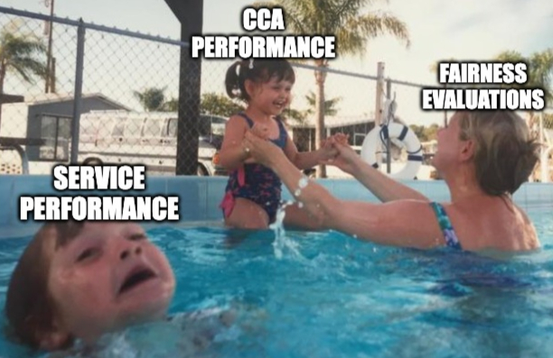

+++
title = "Prudentia: Are Your Favorite Online Services Playing Fair?"
date = 2025-08-20

[taxonomies]
areas = ["Networking", "Systems"]
tags = ["fairness", "networking", "congestion control", "internet", "measurement"]

[extra]
author = {name = "Adithya Abraham Philip", url = "https://aphilip.cc" }
# The committee specification is  a list of objects similar to the author.
committee = [
    {name = "Peter Steenkiste", url = "https://www.cs.cmu.edu/~prs/"},
    {name = "Dimitrios Skarlatos", url = "https://www.cs.cmu.edu/~dskarlat/"},
    {name = "Aditi Kabra", url = "https://aditink.github.io/"}
]
+++
Picture this. It's a warm summer evening. After a long day, your roommate and you settle down on the couch to indulge
your respective Internet-fueled pastimes. You've pulled up undeniably adorable cat videos on YouTube, and your roommate 
is catching up on the latest episode of her favorite TV show on another streaming service. 
But, alas! Your cat videos keep buffering, and when they do finally play, you are forced to bear witness to grainy, 
low quality video, the likes of which you would have expected only a decade ago. 
You glance over to your roommate to commiserate, but—egad, gadzooks—her show is playing at a flawless 4K,
with no stuttering in sight! As Prudentia, our Internet Fairness Watchdog, will reveal to you shortly,
this isn't just bad luck: the design choices made by various Internet services can lead to deeply unfair outcomes
when they compete for limited bandwidth.

Past work has typically pointed the finger at Congestion Control Algorithms (CCAs), a network-stack component which 
determines how quickly an application
sends data, as the likely cause of unfair outcomes. And indeed, CCAs have been shown to be unfair to each other, 
and sometimes, even themselves. For example, past work has shown that Google's CCA, BBR,
was [fundamentally unfair](https://www.cs.cmu.edu//~rware/assets/pdf/ware-imc2019.pdf) to the erstwhile incumbent
CCA, Cubic, in certain network conditions. 
Cubic, in turn, was [unfair to its predecessor](https://www.cs.princeton.edu/courses/archive/fall16/cos561/papers/Cubic08.pdf), NewReno.
Recent work has shown that BBR is unfair to
even other BBR instances at [high flow counts](https://aphilip.cc/assets/files/philip-imc21.pdf).
However, these analyses neglect the fact
that modern Internet services, such as video streaming and conferencing applications, perform application-level optimizations
on top of CCAs to improve the user experience, which could impact fairness outcomes. 
For example, Video streaming services, like YouTube, Vimeo and Netflix, use Adaptive-Bitrate (ABR) algorithms to
select a stable video quality for viewers. Real time video-conferencing services, like Zoom and Google Meet must
additionally ensure they do not flood the network, which would cause delays and jitter for users.
In spite of this, fairness research continues to focus on CCAs, with almost no service-level evaluations.
This motivated us to build Prudentia, the Internet Fairness Watchdog, to bridge this gap, 
and answer a simple but critical question: Are there ‘winners’ and ‘losers’
when popular services compete for bandwidth on the Internet today, and are there mechanisms beyond the CCA 
that determine these outcomes?

[//]: # (![A mother, representing Fairness Evaluations, attentively plays with her daughter, representing CCA performance, while her son, representing Service Performance, struggles to stay afloat next to her, gasping for air.]&#40;./cca-over-service-fairness-narrow.jpg&#41;)
[//]: # ( 
<figure>    <figcaption><i>Fairness evaluations have long focused on evaluating CCA performance, neglecting service-level outcomes. Prudentia remedies this by evaluation services in addition to CCAs.</i></figcaption> </figure>
)
 
<figure>    <figcaption><i>Fairness evaluations have long focused on evaluating CCA performance, neglecting service-level outcomes. Prudentia remedies this by evaluating services in addition to CCAs.</i></figcaption> </figure>

# The Heart of a Watchdog
 
<figure>    <figcaption><i>The topology of the Prudentia testbed.</i></figcaption> </figure>

Typical Internet testbeds run in emulated or simulated environments, where both the services generating traffic 
and the clients consuming them exist within the testbed network. This allows complete visibility and control into the 
network path between the clients and the services. However, applying this approach to real Internet services
would require replicating the service in a local testbed, which given their often proprietary nature is 
error-prone and likely impossible. Alas, is all lost? Will Internet service fairness remain a mystery, divined 
occasionally by blood sacrifices to questionable mystics?

Not at all! Prudentia retains fidelity by using actual Google Chrome instances 
(fully automated with [Selenium](https://www.selenium.dev/). Don't worry, 
no interns were imprisoned in our server rooms.) running on commodity
hardware (2023 M2 [Mac Minis](https://www.youtube.com/watch?v=uDrjeUURSZ4)). We use these to access real Internet services
using their official browser based clients, exactly like a real user. And to retain control over the bottleneck link,
the most important component of the network path when it comes to fairness, we
route all traffic to and from the clients through 
[BESS](https://github.com/NetSys/bess), a software switch from Berkeley, set to emulate a lower bandwidth than typical upstream links.
This lets us enjoy the best of both worlds: realism by accessing deployed
services just as a user would, and the configurability of emulated networks by controlling the bottleneck link.

We configure BESS to emulate two distinct link speeds:
a highly-constrained setting, with a bandwidth of 8 Mbps, and a moderately-constrained
setting, with a bandwidth of 50 Mbps, which correspond to the 10th and 50th-percentile of residential bandwidths
on Ookla's SpeedTest as of 2023. BESS also sets the bottleneck queue size, and normalizes the base network path 
delay (typically referred to as [RTT](https://en.wikipedia.org/wiki/Round-trip_delay)) for more reliable measurements across services.
Prudentia calculates the fraction of bandwidth that each service obtains relative to its "fair share", which we define
as half the available bandwidth or the maximum bandwidth a service can use, whichever is lesser (this accounts for 
services like Netflix, which at its highest quality still consumes just 8 Mbps, 
less than half the bandwidth available in the moderately-constrained setting).

We use this unique infrastructure to test a diverse range of services spanning
streaming video on demand, file distribution, web browsing, real-time video conferencing, and the baseline CCAs 
NewReno, Cubic and BBR using [iPerf3](https://iperf.fr/), a pair at a time. The results from
Prudentia's tests are available to all at [https://internetfairness.net/](https://internetfairness.net/)&#8212;providing
the public access to an independent watchdog that quantifies which services win 
and lose and by how much. We hope this enables both service owners and the wider community identify and
correct excessively unfair outcomes.

# Internet Fairness Outcomes
Prudentia has been running continuously for over two years, and has uncovered a wealth of insights into service interactions
during that time. While all the findings (and more details about the methodology) are discussed in the
[research paper](https://aphilip.cc/assets/files/philip_prudentia_sigcomm24.pdf), we highlight a few of them here:

## Unequal Outcomes Are Common

<figure>

 
<figcaption>
<i>
The fair share of bandwidth obtained by the service in the column when competing against the service in the row. Clearly, unfair outcomes (<80% fair share) are common
</i>
</figcaption>
</figure>

First and foremost, Prudentia finds that unfair bandwidth allocations are not rare, and are in fact a 
common occurrence when services compete for bandwidth. While the possibility of CCA-level unfairness was well known from past 
fairness research, the extent to which it occurs on the Internet with actual services was unclear before Prudentia's
measurements.

## The CCA Alone Doesn't Tell the Whole Story

<figure>

<figcaption><i>The amount of bandwidth obtained by various service when competing against Mega or YouTube. Services competing against Mega get significantly lower than their fair share, while those competing against YouTube tend to get more than their fair share.</i></figcaption>
</figure>

Prudentia was birthed by the hypothesis that testing CCAs alone is not sufficient to predict the unfairness
exhibited by real Internet services. This is vindicated by its finding that services using variants of 
the same CCA can exhibit vastly different fairness behaviors&#8212;best exemplified by YouTube, 
and the popular file-hosting service [Mega](https://mega.com/). 
Both these services use variants of the CCA BBR. However, Mega was found to be one of the most contentious 
services, while YouTube was one of the least contentious, with competing services obtaining 50% and 120% of their 
fair bandwidth shares respectively.
Mega's contentiousness is likely due to its use of multiple flows, while YouTube's sensitivity 
(allowing competing services a larger share of the available bandwidth) is probably linked to its ABR algorithm prioritizing stability,
and the discrete bitrate levels that videos are encoded for.
These are both findings that would have been impossible to arrive at by testing just the CCA,
demonstrating that  testing the entire application stack is necessary to capture 
real-world fairness outcomes.

## Multiple Multi-Flow Services Exist, with Varying Fairness Impacts
CCAs are designed to be flow-level fair, with each connection getting an equal share of bandwidth. It is therefore
well-known in the Internet fairness community that if a service opens multiple connections, it is likely to obtain more
than its fair share of bandwidth. What is surprising however, is that in spite of this knowledge, 
multiple services that Prudentia tested use more than 1 concurrent connection to serve traffic, resulting in varying
extents of unfairness.
Mega uses a custom javascript framework to open up to 5 concurrent
BBR flows to download files, while Netflix and Vimeo use up to 4 NewReno and 2 BBR flows concurrently, respectively.
As seen in the fairness heatmap above, this results in Mega having the most unfair outcomes, followed by Netflix in
bandwidth constrained settings. Vimeo on the other hand, surprisingly provides typically fair outcomes, likely due to
its ABR algorithm.
<figure>

<figcaption><i>CCA designers invest significant energy into designing and testing their CCAs for flow-level fairness. Popular services using multiple flows renders these efforts an exercise in futility.</i></figcaption>

</figure>

## Fairness Outcomes are Often Anomalous

A surprising finding is that many unfair outcomes are anomalous, due to specific interactions between certain services,
and don't always follow a transitive pattern. 
For example, one might assume that if a service α is unfair to service β, and β is unfair to service γ,
α will also be unfair to γ. However, this is not always the case. For example, consider the following 
sets of fairness outcomes:

<table style="margin:auto;border-collapse:collapse;border:1px solid #000;">
  <tr>
    <th rowspan="2" style="border:1px solid #000;">α</th>
    <th rowspan="2" style="border:1px solid #000;">β</th>
    <th rowspan="2" style="border:1px solid #000;">γ</th>
    <th rowspan="2" style="border:1px solid #000;">BW&nbsp;(Mbps)</th>
    <th colspan="3" style="border:1px solid #000;">Fair Share Obtained</th>
  </tr>
  <tr>
    <th style="border:1px solid #000;">by β&nbsp;(vs&nbsp;α)</th>
    <th style="border:1px solid #000;">by γ&nbsp;(vs&nbsp;β)</th>
    <th style="border:1px solid #000;">by γ&nbsp;(vs&nbsp;α)</th>
  </tr>

  <tr>
    <td style="border:1px solid #000;">Mega</td>
    <td style="border:1px solid #000;">NewReno</td>
    <td style="border:1px solid #000;">Vimeo</td>
    <td style="border:1px solid #000;">50</td>
    <td style="background:#ff4d4d;color:#fff;border:1px solid #000;">22%</td>
    <td style="background:#ff4d4d;color:#fff;border:1px solid #000;">58%</td>
    <td style="background:#1a73e8;color:#fff;border:1px solid #000;">104%</td>
  </tr>

  <tr>
    <td style="border:1px solid #000;">Cubic</td>
    <td style="border:1px solid #000;">Dropbox</td>
    <td style="border:1px solid #000;">NewReno</td>
    <td style="border:1px solid #000;">8</td>
    <td style="background:#1a73e8;color:#fff;border:1px solid #000;">99%</td>
    <td style="background:#1a73e8;color:#fff;border:1px solid #000;">106%</td>
    <td style="background:#ff4d4d;color:#fff;border:1px solid #000;">60%</td>
  </tr>

  <tr>
    <td style="border:1px solid #000;">BBR</td>
    <td style="border:1px solid #000;">OneDrive</td>
    <td style="border:1px solid #000;">YouTube</td>
    <td style="border:1px solid #000;">50</td>
    <td style="background:#1a73e8;color:#fff;border:1px solid #000;">108%</td>
    <td style="background:#1a73e8;color:#fff;border:1px solid #000;">106%</td>
    <td style="background:#ff4d4d;color:#fff;border:1px solid #000;">58%</td>
  </tr>
</table>

As seen in the first row, NewReno obtains just 22% of its fair share when competing against Mega, and Vimeo obtains just 58%
of its fair share when competing against NewReno. Since Mega is unfair to NewReno, and NewReno is unfair to Vimeo, one 
might expect Mega to be unfair to Vimeo too. However, when competing against Mega, Vimeo gets more than its fair share
of bandwidth!

This suggests that there are unlikely to be "bellwether" services whose interaction can predict a service's
general fairness properties. Reliable fairness outcome monitoring would therefore require continuous pairwise
testing of popular services.

# In a Nutshell
Prudentia's results show that unfair outcomes are common on the Internet, and that testing the CCA alone is not always
sufficient to predict these outcomes. This impresses upon us both the need for an independent fairness watchdog like
Prudentia, and the necessity of testing services in addition to CCAs.
Some of Prudentia's findings confirmed long-standing knowledge but showed these behaviors are still deployed in
popular services today, such as the negative outcomes from using multiple flows or buffer-filling CCAs 
(the buffer-filling CCAs tested are NewReno, used by Netflix, 
and Cubic, the [most commonly deployed CCA](https://dl.acm.org/doi/10.1145/3651890.3672255), and used by OneDrive). 
Other findings were novel, like the discovery and characterization of multi-flow services such as Mega,
and the unexpected interactions between certain services. Many results were surprising and hard to diagnose without
access to the proprietary application-level algorithms powering many of these services, emphasizing the need to include
service owners in the conversation. Together, guided by Prudentia, we believe that we can move towards a fairer, more performant Internet
for everyone.

[//]: # ()
[//]: # (# Lessons for Future Testing)

[//]: # (## Service Developers Need to Test for Fairness)

[//]: # (Congestion control developers typically test for fairness, )

[//]: # (while service developers often do not, likely due to the belief that the CCA "handles" it. Prudentia's results show)

[//]: # (this is not the case;)

[//]: # (application-layer design decisions can significantly affect fairness outcomes. )

[//]: # (To ease the resulting burden on service developers, Prudentia allows external services to be submitted )

[//]: # (for evaluation as part of its testbed. Instructions for submission are available on its [website]&#40;https://internetfairness.net/testing.)

[//]: # (## Pairwise Testing is Necessary Across Settings)

[//]: # (Given the anomalous nature of fairness outcomes and the lack of )

[//]: # (bellwether services, testing services against each other in various network conditions is crucial. )

[//]: # (## Testing needs to be continuous)

[//]: # ()
[//]: # (## Test with commodity hardware)

[//]: # (Our initial clients were "headless" &#40;monitor-free&#41; servers, that)

[//]: # (did not have hardware support for video decoding VP9, something most commodity hardware possesses. )

[//]: # (This resulted in services like YouTube not playing video at the highest quality, resulting in it obtaining )

[//]: # (artificially reduced share of bandwidth. Using commodity hardware like the Mac Mini fixed this.)

# What's Next for Prudentia?

Future work for Prudentia includes scaling up to test more services, a wider range of network settings
(like different bottleneck queue sizes, RTTs, random packet loss), and various vantage points globally.
This expanded testing will provide an even richer understanding of how services interact in the diverse environments
seen on the Internet.
Prudentia continues to serve as an essential independent watchdog, shedding light on the critical issue of 
Internet fairness at the application level. By evaluating full application stacks under contention, 
it provides valuable data that encourages service providers and researchers to consider the broader
impact of their design choices on the miraculous shared network that is the Internet.
Want to see the results or submit a service for testing? Visit the Prudentia website at https://www.internetfairness.net!
